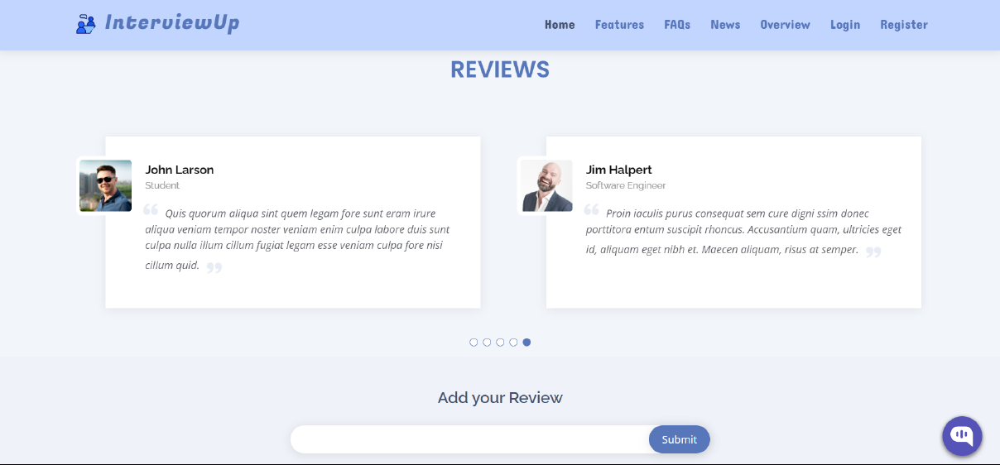
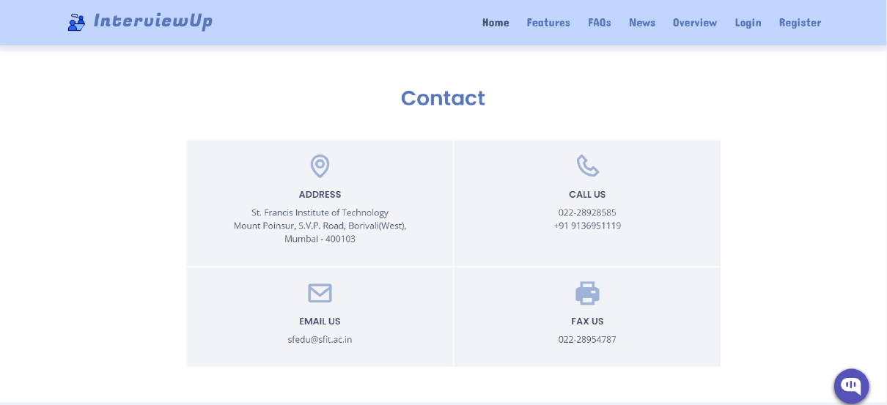
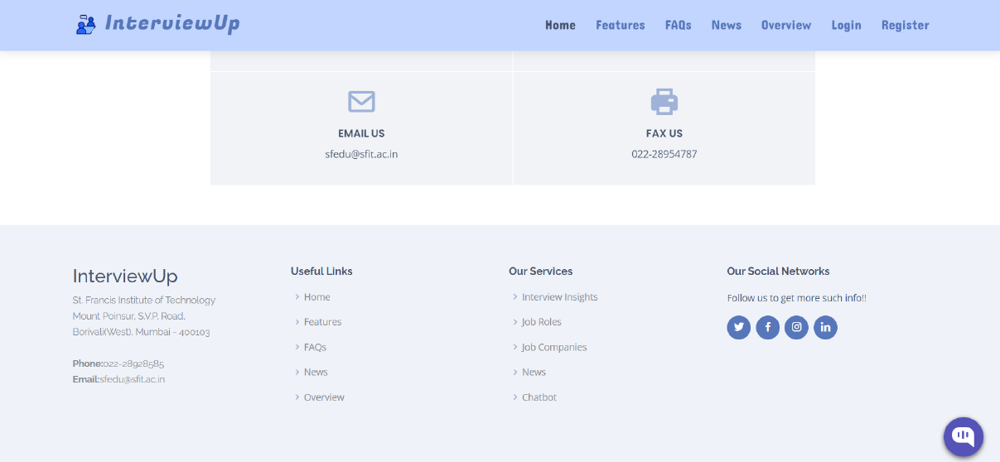
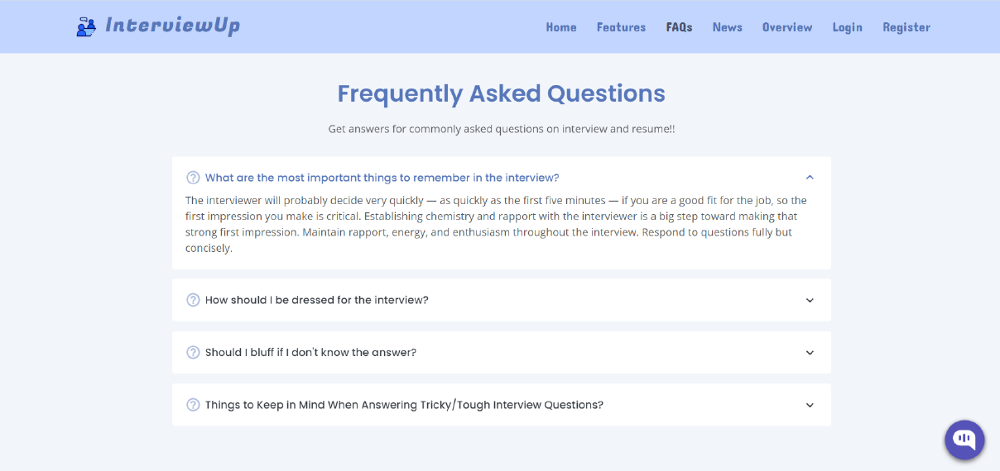
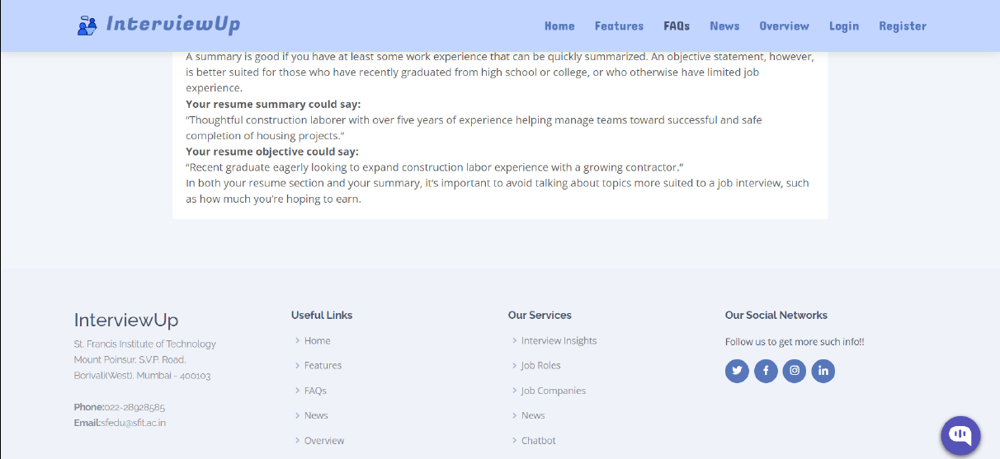
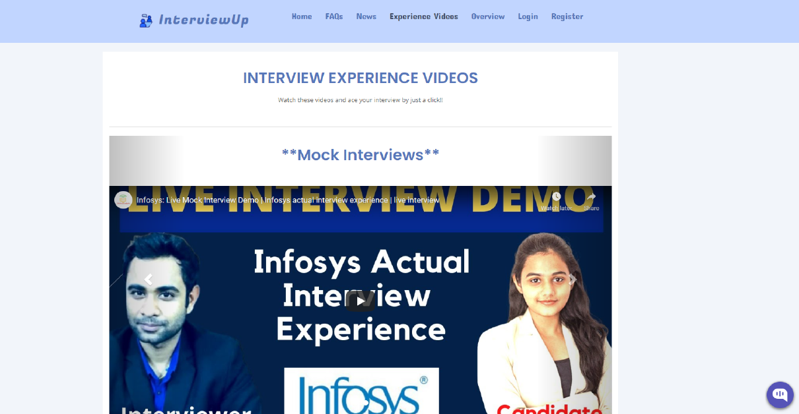

# InterviewUp 💻

    

## <a name="system">What does it include?</a>

**InterviewUp Web Application** is created to help the job seekers get an insight about their potential job roles and job companies and thus acquire complete guidance with interview questions and interview video experiences. It has various other features that include getting a job domain, obtain lastest news related to jobs and chatbot to solve user queries related to interviews (Developed using DialogFlow).

---

## <a name="system">Tech Stack Involved?</a>

**FRONTEND**
- HTML
- CSS
- Bootstrap
- Javascript

**BACKEND**
- Django/Python
- PostgreSQL

---

## <a name="Results?">Results?</a>

<table style="width:2800px; border: black; margin: 0px auto;" class="skinny" cellspacing="0" cellpadding="0">
    <tr>
        <td>
            
        </td>
        <td>
            
        </td>
        <td>
            
        </td>
        <td>
            
        </td>
    </tr>
    <tr>
        <th>Register Page</th>
        <th>Login Page</th>
        <th>Home Page(a)</th>
        <th>Home Page(b)</th>
    </tr>
    <tr>
        <td>
            
        </td>
        <td>
            
        </td>
        <td>
            
        </td>
        <td>
            
        </td>
    </tr>
    <tr>
        <th>Home Page(c)</th>
        <th>Home Page(d)</th>
        <th>Home Page(e)</th>
        <th>FAQ Page(a)</th>
    </tr> 
    <tr>
        <td>
            
        </td>
        <td>
            
        </td>
        <td>
            
        </td>
        <td>
            
        </td>
    </tr>
    <tr>
        <th>FAQ Page(b)</th>
        <th>Overview Page</th>
        <th>Resume Input Page</th>
        <th>Chatbot</th>
    </tr>
    <tr>
        <td>
            
        </td>
        <td>
            
        </td>
        <td>
            
        </td>
    </tr>
    <tr>
        <th>Interview Experience Videos Page</th>
        <th>Interview Questions Page</th>
        <th>Job Roles and Job Companies Page</th>
    </tr>
</table>

---
